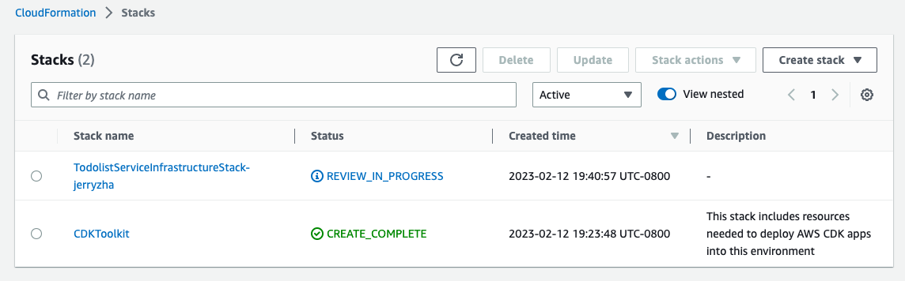
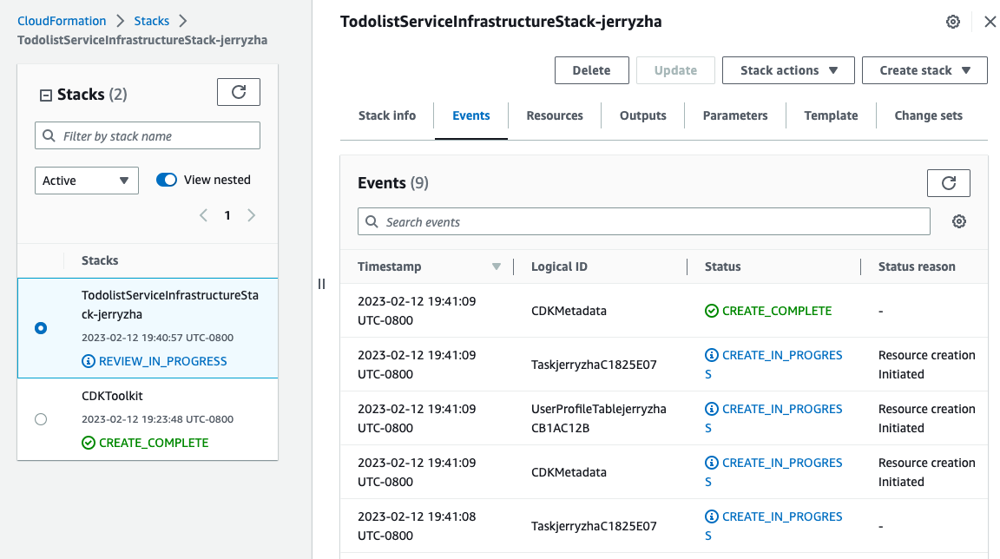

# Welcome to your CDK TypeScript project

This is a blank project for CDK development with TypeScript.

The `cdk.json` file tells the CDK Toolkit how to execute your app.

## Useful commands

* `npm run build`   compile typescript to js
* `npm run watch`   watch for changes and compile
* `npm run test`    perform the jest unit tests
* `cdk deploy`      deploy this stack to your default AWS account/region
* `cdk diff`        compare deployed stack with current state
* `cdk synth`       emits the synthesized CloudFormation template

## Getting Started

This repository contains code that defines the AWS infrastructure required for the Todolist Service. Before you get started, make sure you have downloaded and configured your AWS CLI, along with the CDK CLI.
* https://docs.aws.amazon.com/cdk/v2/guide/getting_started.html#getting_started_prerequisites
* https://docs.aws.amazon.com/cdk/v2/guide/getting_started.html#getting_started_install

One thing to note is that the DEFAULT REGION we should be using is `us-west-2'. Make sure you set the region in the console to that, as well as your CLI parameter.

Once you have those setup, follow these instructions to deploy your development stack:
1. Copy the `.env.sample` file and name it `.env`. Add your own username to it. This is telling the code that we are deploying test infrastructure. Each developer will have their own test infrastructure custom to them. The infrastructure without our usernames are production infrastructure.
2. Run the command `cdk synth` to see your output CloudFormation template. For example, here's what the first few lines of mine look like:
```
Resources:
  UserProfileTablejerryzhaCB1AC12B:
    Type: AWS::DynamoDB::Table
    Properties:
      KeySchema:
        - AttributeName: userProfileId
          KeyType: HASH
      AttributeDefinitions:
        - AttributeName: userProfileId
          AttributeType: S
      ProvisionedThroughput:
        ReadCapacityUnits: 5
        WriteCapacityUnits: 5
      TableName: UserProfileTable-jerryzha
    UpdateReplacePolicy: Retain
    DeletionPolicy: Retain
    Metadata:
      aws:cdk:path: TodolistServiceInfrastructureStack-jerryzha/UserProfileTable-jerryzha/Resource
...
```
3. After verifying that all the expected resoures showed up, let's deploy the stack! Run `cdk deploy`. If this is your first time running this command, you'll see something like this in your CloudFormation console:





Once it says "Create Complete", your stack is good to go. If you need to make further changes to CDK and want to update changes, you can run `cdk diff` first to check what changes in output will happen before running `cdk deploy`.
